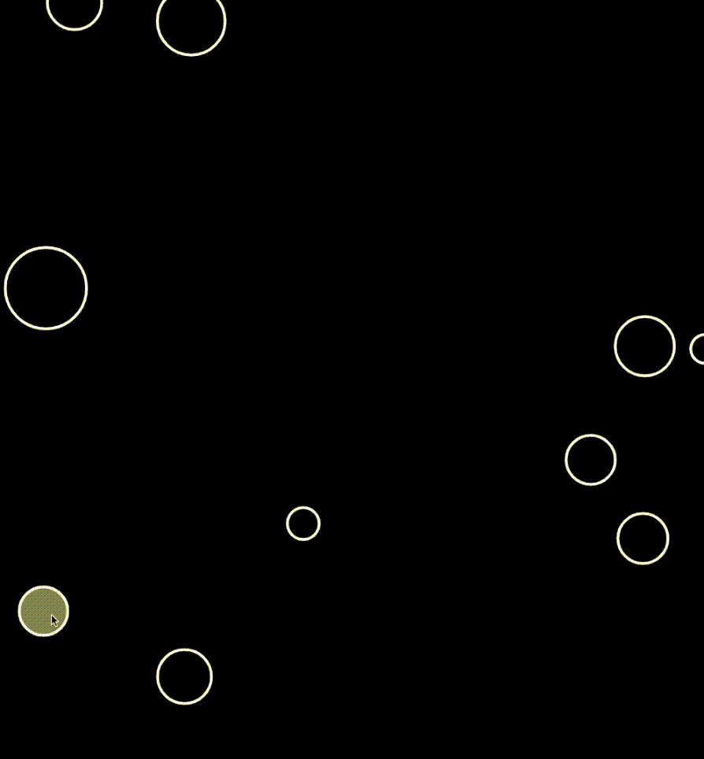

# Remove Objects From Arrays P5.JS

- Using OOP with JS and P5.JS

- Create object class and constructors

- P5.JS mousePressed() used to act on the bubble objects

- On mousePressed() object is spliced() from array

